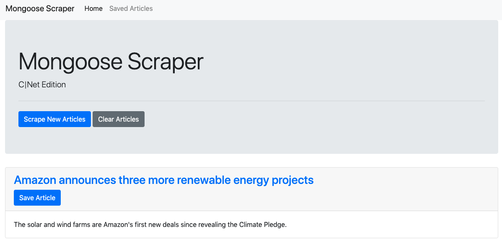
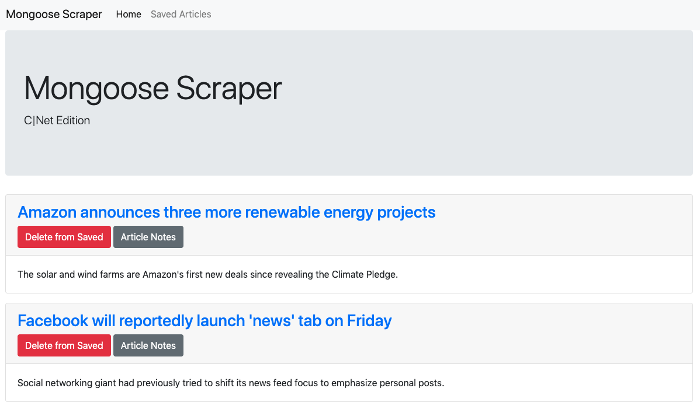
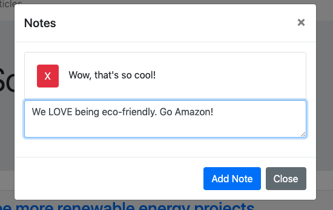

# Mongoose-Scraper
This application allows a user to scrape articles from the cnet.com/news site, choose articles to save for later, and add/delete notes to each article.

At the homepage, 

users may click the "Scrape New Articles" button to scrape articles from the CNet page. New articles will only be scraped if there are no articles already loaded on the page. Users can also click the "Clear Articles" button, which will get rid of all articles, saved or not. If a user clicks the "Save Article" button on a given article, the article will be cleared from the homepage and will be added to the page of "Saved Articles."

Users can view articles that they have saved by clicking on the "Saved Articles" link in the navbar. 

Each article has a "Delete from Saved" and "Article Notes" button.  Clicking the "Delete from Saved" button will delete the article altogether from the database. Clicking the "Article Notes" button will bring out a modal with any existing notes, and a textbox for the user to input a new note.

When a user clicks the "Add Note" button, the note that they typed in to the textbox will be saved to the database, associated with the corresponding article. Users may delete notes by clicking on the red X button on the left of the note.

## Technologies Used
- Express
- Axios
- Handlebars
- Mongoose
- Cheerio
- Bootstrap